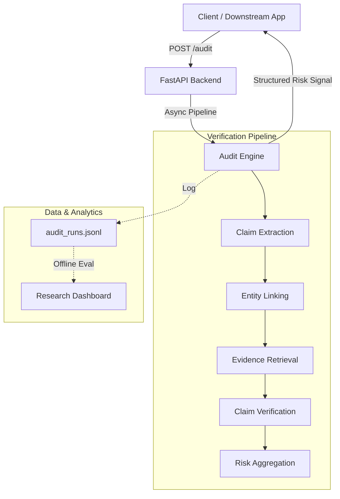
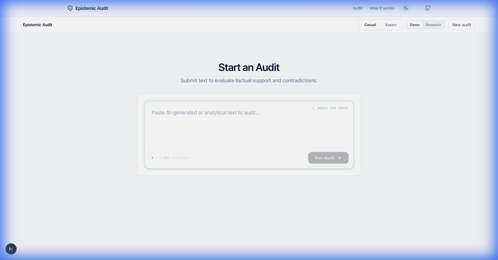
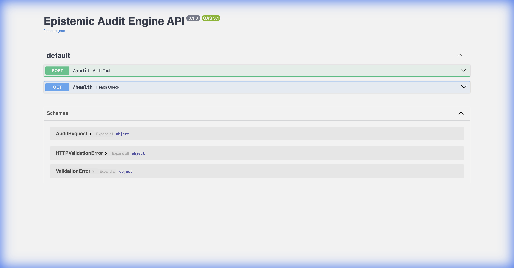
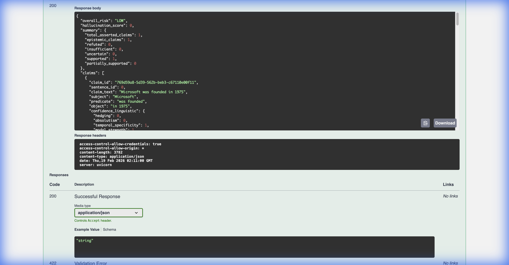
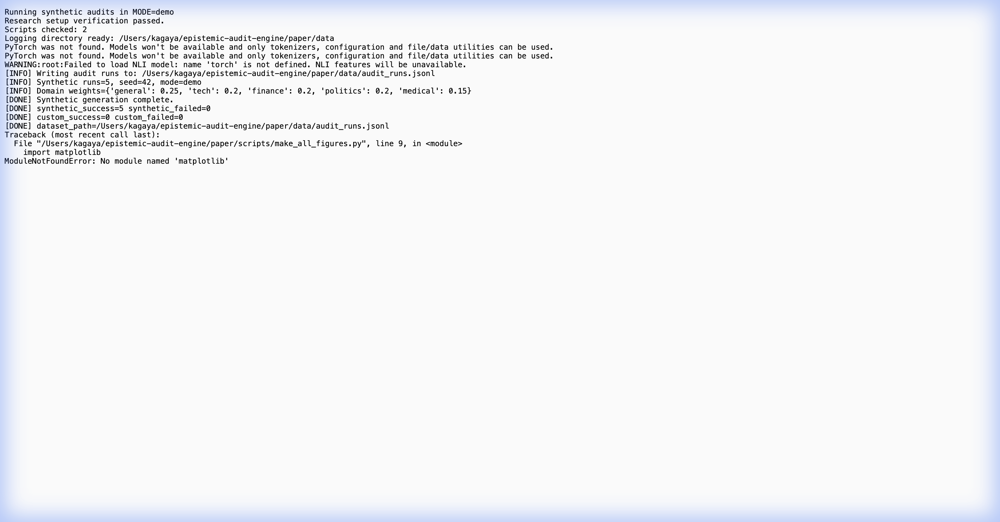

# Epistemic Audit Engine

LLM Output Verification Middleware for Claim-Level Reliability Auditing in Long-Form Generated Text.

Production-style runtime service for auditing GenAI outputs and assigning epistemic risk signals prior to downstream system usage.

---

## Runtime Service Overview



---

## Audit Runtime Interface



### Interactive Auditing
The frontend provides a research-grade interface for manual inspection of model outputs:
- **Input**: Paste generated text (up to 20k chars).
- **Process**: Visualize the claim extraction and verification process in real-time.
- **Output**: Granular, claim-level verdicts (Supported, Refuted, Uncertain) with linked evidence.

Ideal for: **Red-teaming**, **Policy tuning**, and **Qualitative analysis** of model failure modes.

---

## Backend API Surface



### Runtime Spec
- **Runtime**: FastAPI (Python 3.11+)
- **Entrypoint**: `POST /audit`
- **Observability**: `GET /health` for readiness probes.
- **Concurrency**: Async-first pipeline design for high-throughput auditing.

```bash
# Example Health Check
curl http://localhost:8000/health
```

---

## Structured Output Schema



### Integration Signal
The engine produces a strictly typed JSON response designed for programmatic consumption:

- **`overall_risk`**: High-level traffic light signal (LOW, MEDIUM, HIGH) for gating.
- **`hallucination_score`**: Normalized [0-1] score for threshold-based filtering.
- **`claims`**: Array of atomic claims with individual verdicts and evidence context.

Use this payload to:
1. **Block** high-risk responses.
2. **Flag** uncertain claims for human review.
3. **Inject** citations back into the generation.

---

## Runtime Logging + Eval Dataset Construction


### Continuous Evaluation
Every request to the inference endpoints is automatically logged to an append-only JSONL event stream:
- **Traceability**: Full input/output capture with timestamp and configuration metadata.
- **Dataset Generation**: Logs can be directly consumed by the evaluation harness to build fine-tuning datasets or regression benchmarks.
- **Reproducibility**: Contains all necessary state to replay audits ensuring deterministic behavior.

File path: `paper/data/audit_runs.jsonl`

---

## Evaluation Harness



### Automated Benchmarking
Reproducible research capabilities are built-in as first-class citizens:
- **Seed Control**: Deterministic execution for reliable regression testing.
- **Prompt Perturbation**: Evaluate massive batches of synthetic outputs.
- **Artifact Generation**: Automatically produces PDF/PNG analysis figures for calibration reports.

Run the harness:
```bash
EPI_SYNTH_MODE=demo EPI_SYNTH_RUNS=500 bash scripts/run_research.sh
```

---

## Health Monitoring


### Production Readiness
- **Liveness**: Simple HTTP 200 OK.
- **Readiness**: Checks pipeline initialization and model loading status.
- **Uptime**: Tracks service stability.

---

## Deployment Runtime

### Stack
- **Backend**: Python / FastAPI / Uvicorn
- **Frontend**: Next.js (React) / Tailwind
- **Orchestration**: Dockerizable services, ready for Kubernetes or ECS.

### Service Entrypoints
- **Backend**: `uvicorn app:app --host 0.0.0.0 --port 8000`
- **Frontend**: `npm start` (port 3000)

---

## Integration Use Case

### Enterprise GenAI Guardrails
Integrate **Epistemic Audit Engine** as a middleware layer in your RAG or Copilot architecture:

1. **Internal Copilots**: Prevent hallucinated policy advice in HR/Legal bots.
2. **Document QA**: Verify answers against retrieval context before showing to users.
3. **Compliance Pipelines**: Audit generated marketing copy for factual claim reliability.
4. **Moderation**: Automate the detection of unsubstantiated claims in user-generated content.

**Flow:**
`LLM Generation` -> `Epistemic Audit` -> `(Low Risk)` -> `User`
                                      `-> (High Risk)` -> `Fallback / Warning`
